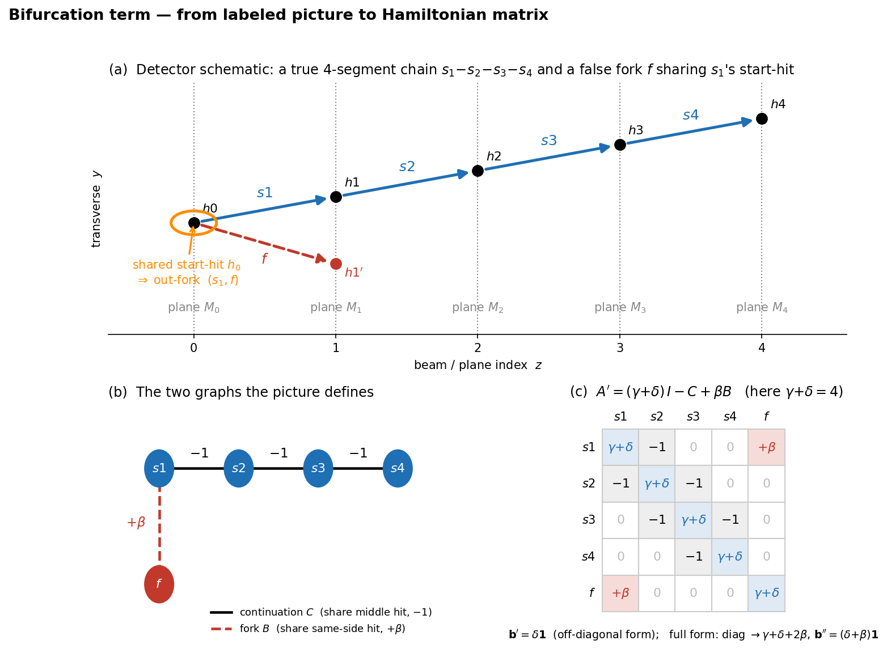

# Adding a bifurcation (fork) term to the segment Hamiltonian

**Purpose.** This note explains, from the ground up and with a fully worked
labelled example, what the **Denby–Peterson bifurcation (fork) penalty** is, how
a picture of hits and segments turns into the modified Hamiltonian matrix, and how
that matrix is built and solved in the code. Read §1 for the concrete example
(picture → matrix → numbers), §2 for the general derivation, §3–§7 for the
behaviour at scale and the classical/quantum difference, and §8 for the code.

**Operating point** unless stated: γ = 3, δ = 1, so the diagonal is
s ≡ γ+δ = 4 and the base activation threshold is τ = δ/(δ+γ) + 0.10 = 0.35.

---

## 0. The objects (one-paragraph recap of the base model)

The detector is a stack of **planes** (VeLo modules). A **hit** is a recorded
point on a plane. A **segment** is a straight line joining a hit on one plane to a
hit on the *next* plane — so **every segment touches exactly two hits**, a start-hit
and an end-hit (this two-hits-per-segment fact is what keeps the diagonal constant
later, §2). A **true** segment joins two hits of the *same* particle; a **false**
segment joins hits of different particles (or noise). The solver assigns each
segment $i$ a continuous **activation** $x_i\in\mathbb{R}$ by solving a sparse
linear system, and declares a segment **active** when $x_i>\tau$.

The base ("continuation only") system is

$$
A_0\,\mathbf{x}=\mathbf{b}_0,\qquad \mathbf{b}_0=\delta\mathbf{1},\qquad
A_0=(\gamma+\delta)\,I-C .
$$

$C$ is the **continuation adjacency**: $C_{ij}=1$ when segment $i$ and segment $j$
form a *compatible continuation* — the end-hit of one is the start-hit of the other
(they **share a middle hit**) **and** the kink angle between them is below $\varepsilon$.
So $A_0$ has $\gamma+\delta$ on the diagonal and $-1$ on every continuation pair.
A true track is a *chain* of continuations and ends up with high activation; an
isolated false segment has no continuations and sits at the Hopfield floor
$\delta/(\gamma+\delta)=0.25$, below τ. The weakness of this model (established in
`../Segment_level_studies/`): the surviving **false positives are cross-track
clusters** — *forks* (one hit shared by several segments) and *bridges* (a short
accidental chain between two real tracks). The bifurcation term targets the forks.

---

## 1. A labelled worked example — from picture to matrix to numbers

Everything below is a single hand-built cluster of **five segments** (`make_schematic.py`),
small enough to do entirely by hand and check against the solver.



### 1.1 The picture (panel a)

Five planes $M_0,\dots,M_4$. One real particle leaves five hits in a straight line,
$h_0,h_1,h_2,h_3,h_4$ (one per plane). There is one extra hit $h_1'$ on plane
$M_1$ (a different particle / noise). From these hits the model builds five
segments:

| segment | start-hit | end-hit | kind |
|---|---|---|---|
| $s_1$ | $h_0$ | $h_1$ | true |
| $s_2$ | $h_1$ | $h_2$ | true |
| $s_3$ | $h_2$ | $h_3$ | true |
| $s_4$ | $h_3$ | $h_4$ | true |
| $f$   | $h_0$ | $h_1'$ | **false fork** |

The false segment $f$ leaves the **same hit $h_0$** as $s_1$ but heads to the wrong
plane-1 hit. That shared start-hit is the bifurcation: hit $h_0$ would feed *two*
segments at once.

### 1.2 The continuation graph $C$ (share a *middle* hit) — panel b, solid edges

Go through every ordered pair and keep it when one segment's **end-hit equals the
other's start-hit**:

- $s_1(h_0\!\to\! h_1)$ and $s_2(h_1\!\to\! h_2)$ share $h_1$ → continuation.
- $s_2,s_3$ share $h_2$; $s_3,s_4$ share $h_3$.
- $f$ ends at $h_1'$, which no segment starts from → $f$ has **no** continuation.

(All kinks here are zero, so every shared-middle-hit pair passes the $<\varepsilon$ test.)
That gives the chain $s_1\!-\!s_2\!-\!s_3\!-\!s_4$:

$$
C=\begin{pmatrix}0&1&0&0&0\\ 1&0&1&0&0\\ 0&1&0&1&0\\ 0&0&1&0&0\\ 0&0&0&0&0\end{pmatrix}
\quad(\text{rows/cols }s_1,s_2,s_3,s_4,f).
$$

### 1.3 The fork graph $B$ (share a *same-side* hit) — panel b, dashed edge

Now keep every pair that shares a hit **on the same side** — both start at one hit
(*out-fork*) or both end at one hit (*in-fork*):

- $s_1$ and $f$ both **start** at $h_0$ → out-fork, $B_{s_1 f}=1$.
- no other pair shares a start- or an end-hit.

$$
B=\begin{pmatrix}0&0&0&0&1\\ 0&0&0&0&0\\ 0&0&0&0&0\\ 0&0&0&0&0\\ 1&0&0&0&0\end{pmatrix}.
$$

**Key point: $C$ and $B$ act on disjoint pairs.** $C$ couples *opposite-side*
sharing (end-of-one = start-of-other, a genuine continuation); $B$ couples
*same-side* sharing (two ins or two outs at one hit, a competition). They never
mark the same pair.

### 1.4 Assemble the Hamiltonian (panel c)

The diagonal is $\gamma+\delta=4$; continuations contribute $-1$; forks contribute
$+\beta$ (repulsive). The two forms differ only in the diagonal and the bias:

**Off-diagonal form** $\;A'=(\gamma+\delta)\,I-C+\beta B,\qquad \mathbf b'=\delta\mathbf 1$:

$$
A'=\begin{pmatrix}
4&-1&0&0&\beta\\ -1&4&-1&0&0\\ 0&-1&4&-1&0\\ 0&0&-1&4&0\\ \beta&0&0&0&4
\end{pmatrix},\qquad \mathbf b'=\begin{pmatrix}1\\1\\1\\1\\1\end{pmatrix}.
$$

**Full Denby–Peterson form** $\;A''=(\gamma+\delta+2\beta)\,I-C+\beta B,\qquad \mathbf b''=(\delta+\beta)\mathbf 1$:
same off-diagonals, but the diagonal becomes $4+2\beta$ and the bias becomes
$(1+\beta)\mathbf 1$. (Where these come from: §2.)

### 1.5 Solve, and read off the effect

Solving $A\mathbf x=\mathbf b$ for a β-sweep (numbers from `make_schematic.py` /
the verification script — they agree to all printed digits):

**Off-diagonal form** (attractor fixed at $\delta/s=0.25$, so the bare τ = 0.35 still applies):

| β | $x_{s_1},x_{s_2},x_{s_3},x_{s_4}$ (true) | $x_f$ (false fork) | eigenvalues of $A'$ |
|---|---|---|---|
| 0.0 | 0.364, 0.455, 0.455, 0.364 | **0.250** | 2.382, 3.382, **4**, 4.618, 5.618 |
| 0.5 | 0.336, 0.447, 0.453, 0.363 | **0.208** | 2.359, 3.254, **4**, 4.746, 5.641 |
| 1.0 | 0.318, 0.442, 0.451, 0.363 | **0.171** | 2.268, 3.000, **4**, 5.000, 5.732 |
| 2.0 | 0.314, 0.441, 0.451, 0.363 | **0.093** | 1.697, 2.697, **4**, 5.303, 6.303 |

The false fork is driven **down** ($0.25\to0.09$) while the true chain barely
moves. You can see exactly why from $f$'s row of $A'\mathbf x=\mathbf b'$, which is

$$
(\gamma+\delta)\,x_f+\beta\,x_{s_1}=\delta
\;\;\Longrightarrow\;\;
x_f=\frac{\delta-\beta\,x_{s_1}}{\gamma+\delta}=\frac{1-\beta\,x_{s_1}}{4}
\;\xrightarrow{\ \beta\uparrow\ }\ \text{below }0.25\text{, toward }0 .
$$

The active true segment $s_1$ *repels* its competitor $f$ through the $+\beta$
coupling. This is the whole intent of the term, in one equation.

**Full form** (attractor $(\delta+\beta)/(\gamma+\delta+2\beta)$ **rises** with β):

| β | $x_{s_1..s_4}$ (true) | $x_f$ | attractor | β-aware τ |
|---|---|---|---|---|
| 0.0 | 0.364, 0.455, 0.455, 0.364 | 0.250 | 0.250 | 0.350 |
| 0.5 | 0.367, 0.468, 0.472, 0.394 | 0.263 | 0.300 | 0.400 |
| 1.0 | 0.367, 0.475, 0.481, 0.414 | 0.272 | 0.333 | 0.433 |
| 2.0 | 0.364, 0.482, 0.490, 0.436 | 0.284 | 0.375 | 0.475 |

Here the whole spectrum is shifted up by $2\beta$ and the bias raised to $\delta+\beta$,
so $x_f$ only *drifts* (0.25 → 0.28) — the suppression is **relative to a rising
floor**, and the bare τ = 0.35 is no longer the right cut. The full form needs a
**β-aware threshold**

$$
\tau(\beta)=\frac{\delta+\beta}{\gamma+\delta+2\beta}+0.10 .
$$

> **Take-away (single fork).** With one fork partner the off-diagonal form is a
> clean fork-suppressor at fixed τ; the full form rescales the spectrum and needs
> a β-aware τ. Both forms keep a *constant diagonal* (next section) so both can run
> on the quantum filter.

---

## 2. Where the term comes from (the general derivation)

A real track uses each hit **once**: one segment in, one segment out. A
**bifurcation** violates this — one hit feeding (or fed by) several active segments.
Group the segments by the hit they share on a side: for each hit $h$ there is an
"out-group" (segments starting at $h$) and an "in-group" (segments ending at $h$).
Let $\mathcal G$ be the set of all such groups. The fork adjacency is exactly
*two segments in a common group*:

$$
B_{ij}=\big[\,i\neq j\ \text{and}\ \big(\operatorname{start}(i)=\operatorname{start}(j)\ \text{or}\ \operatorname{end}(i)=\operatorname{end}(j)\big)\,\big].
$$

Two distinct segments share at most one hit, so each forked pair lies in exactly one
group and $\sum_{g\in\mathcal G}\sum_{i\neq j\in g}x_ix_j=\mathbf x^\top B\mathbf x$ **exactly**.

**The penalty (continuous form → off-diagonal).** Denby–Peterson charges every
*pair* of co-active segments meeting at a hit. Written directly as a quadratic cost
on the continuous activations $x_i\in\mathbb R$ that the solver actually produces,

$$
E_{\rm bif}(\mathbf x)=\frac{\beta}{2}\sum_{g\in\mathcal G}\ \sum_{i\neq j\in g}x_ix_j
=\frac{\beta}{2}\,\mathbf x^\top B\,\mathbf x .
$$

The base solve is the stationary point of $E_0=\tfrac12\mathbf x^\top A_0\mathbf x-\mathbf b_0^\top\mathbf x$
($\nabla E_0=A_0\mathbf x-\mathbf b_0$). Adding $E_{\rm bif}$ and setting
$\nabla(E_0+E_{\rm bif})=0$ with $\nabla E_{\rm bif}=\beta B\mathbf x$ gives the

> **off-diagonal form** $\;\boxed{A'=(\gamma+\delta)I-C+\beta B,\quad \mathbf b'=\delta\mathbf 1}$.

There is **no** diagonal contribution because $B$ has none — a segment is never
forked with itself — so $A'$ keeps the bare diagonal $\gamma+\delta$ and bare bias
$\delta\mathbf 1$.

**The full (binary) Denby–Peterson form.** In the original network the neurons are
**binary**, $x_i\in\{0,1\}$, so $x_i^2=x_i$ and the *same* pairwise cost may be
rewritten with a per-group occupancy $N_g=\sum_{i\in g}x_i$, using
$\sum_{i\neq j\in g}x_ix_j=N_g^2-\sum_{i\in g}x_i^2=N_g^2-N_g$:

$$
E_{\rm bif}(\mathbf x)=\frac{\beta}{2}\sum_{g\in\mathcal G}
\Big[\big(\textstyle\sum_{i\in g}x_i\big)^2-\sum_{i\in g}x_i\Big]
=\frac{\beta}{2}\sum_{g\in\mathcal G}N_g(N_g-1)
$$

— it charges $\tfrac{\beta}{2}N(N-1)$ for a group of occupancy $N$ (zero for one
segment, growing for two or more). The two expressions agree at every binary
configuration but **differ off the corners of the cube**: the binary rewrite replaces
the self-term $\sum_{i\in g}x_i^2$ by the linear $\sum_{i\in g}x_i$. Differentiating it —
and using that **each segment lies in exactly two groups** (its start- and end-group,
so $\sum_{g\ni k}\sum_{i\in g}x_i=2x_k+(B\mathbf x)_k$ and $\sum_{g\ni k}1=2$) —

$$
\frac{\partial E_{\rm bif}}{\partial x_k}
=\frac{\beta}{2}\sum_{g\ni k}\Big[2\!\sum_{i\in g}x_i-1\Big]
=\beta\big(2x_k+(B\mathbf x)_k\big)-\beta ,
\qquad\text{i.e.}\quad \nabla E_{\rm bif}=\beta(2\mathbf x+B\mathbf x)-\beta\mathbf 1 .
$$

Now $\nabla(E_0+E_{\rm bif})=0$ reads $(A_0+2\beta I+\beta B)\mathbf x=\mathbf b_0+\beta\mathbf 1$, the

> **full Denby–Peterson form** $\;\boxed{A''=(\gamma+\delta+2\beta)I-C+\beta B,\quad \mathbf b''=(\delta+\beta)\mathbf 1}$.

**The two forms are not two truncations of one gradient.** $A'$ is the *exact*
gradient of the continuous pairwise penalty $\tfrac{\beta}{2}\mathbf x^\top B\mathbf x$;
$A''$ is the *exact* gradient of the binary occupancy penalty
$\tfrac{\beta}{2}\sum_gN_g(N_g-1)$. The extra $2\beta I$ (diagonal) and $\beta\mathbf 1$
(bias) carried by $A''$ are precisely the *self-occupancy* pieces the binary rewrite
keeps and the continuous form drops; they vanish as $\beta\to0$, where the two
coincide.

**Why the diagonal stays constant — and why that matters.** The occupancy term
contributes the diagonal piece $2\beta x_k$ for *every* segment, because **every
segment is in exactly two groups** (one per adjacent plane). It is never a
per-segment, fork-degree-dependent diagonal cost — the fork degree enters only the
*off-diagonal* $\beta B$. So both $A'$ and $A''$ have a **constant diagonal**
($\gamma+\delta$ for $A'$, $\gamma+\delta+2\beta$ for $A''$). The one-bit quantum
filter (1BQF) requires a constant diagonal (it sets its evolution time from it),
so **both forms are 1BQF-compatible** in principle. The diagonal sets the notch
position $\lambda=\text{diag}$ and the evolution time $t=\pi/\text{diag}$; in the
full form both shift with β.

### Two choices for the fork graph $B$

- **Full occupancy $B$** — *all* co-hit pairs, regardless of angle (the naïve
  Denby–Peterson term). Every hit starts $O(T)$ segments, all mutually forked, so
  $B$ is **dense**, $\mathrm{nnz}=O(T^3)$. Analysed as the worst case in §3–§6.
- **ε-windowed $B_\varepsilon$** — only co-hit pairs whose **mutual angle is $<\varepsilon$**
  (inside the acceptance window): *of the segments meeting at a hit within ε, you
  are punished for choosing more than one.* This is **sparse**,
  $\mathrm{nnz}=O(n_{\rm seg})$, and is the **production choice** — §7.

---

## 3. The dense-event reality — equal fork degree

The clean suppression of §1 assumed $f$ has **one** fork partner. In a real event
that is false: every hit on an interior plane starts $O(T)$ candidate segments, all
mutually forked, so **every** segment — true or false — has a large fork degree.
Measured on stored events, **the median fork degree of true and false segments is
essentially equal** (≈ 38 at T = 20, ≈ 98 at T = 50). The penalty therefore pushes
true and false activations down at *the same rate* (off-diagonal form, stored
T = 50 event):

| β | median $x_{\rm true}$ | median $x_{\rm false}$ | ratio | AUC(true:false) |
|---|---|---|---|---|
| 0.00 | 0.423 | 0.250 | 1.69 | 1.000 |
| 0.01 | 0.340 | 0.200 | 1.70 | 1.000 |
| 0.05 | 0.191 | 0.111 | 1.72 | 1.000 |
| 0.10 | 0.125 | 0.072 | 1.74 | 1.000 |

So the dense $\beta$ acts as a near-**uniform down-scaling**: the true/false ratio
and the ranking (AUC = 1.000) are unchanged, only the absolute scale shrinks. What
separates true from false is **not** the fork degree (equal) but the
**continuation attraction** (the $-1$ chain) that only true segments enjoy — which
the base model already exploits.

**Consequence — a threshold artefact.** At a *fixed* τ the down-scaling makes a
false at 0.25 and an outer true at 0.364 cross below 0.35 at almost the same β, so
efficiency *and* false-rate collapse together. That is not a real purity win; the
honest readouts are a **β-aware τ** and the **separation / AUC**. The dense fork is
**not** a targeted false-positive fix, because the dangerous false positives are
cross-track *bridges* — coupled clusters carrying the same continuation+fork
structure as a real track, so the fork term cannot tell them apart.

---

## 4. Spectrum and the notch

Write $A=\text{diag}\cdot I-M$ with $M=C-\beta B$. Then $\lambda=\text{diag}-\mu(M)$,
and a **notch eigenvalue** is still $\lambda=\text{diag}\iff\mu(M)=0$. The 1BQF
filter $f(\lambda)=\cos(\lambda t/2)$, $t=\pi/\text{diag}$, erases the notch
eigenspace. What the fork changes:

- In the base model the **false bulk** (isolated segments) is one giant notch
  degeneracy. Adding $\beta B$ couples it — **but the fork graph has a large null
  space**: a repulsive fork star $K_{1,m}$ (one segment forked by $m$ others) gives
  $A$-eigenvalues $\text{diag}-\{-\sqrt m\,\beta,\,0^{(m-1)},\,+\sqrt m\,\beta\}$, so
  **$m-1$ modes stay exactly on the notch** and only two split off. The notch
  degeneracy **largely survives** (in the 5×5 example a $\{3,5\}$ pair opens at β=1
  while a notch mode at 4 persists — see the eigenvalue column in §1.5).
- The visible *classical* effect is therefore on the **solution scale**, not the
  spectrum.

---

## 5. Effect on the segment-level metrics (what to expect)

With efficiency $=n_{\rm TA}/n_{\rm true}$, purity $=n_{\rm TA}/n_{\rm act}$,
false-rate $=n_{\rm FA}/n_{\rm act}$:

- **At fixed τ = 0.35:** efficiency *and* false-rate fall steeply together (the §3
  threshold artefact), not a genuine purity win.
- **At a β-aware / AUC readout:** AUC ≈ 1 and the true/false ratio is flat, so the
  dense fork buys **little** separability over the base model on clean low-T events.
- **Not a targeted fix:** the real false positives (bridges) are coupled clusters
  indistinguishable from true tracks to the fork term.

---

## 6. Classical vs quantum — the key difference (dense fork)

1. **Both forms run on the 1BQF** (constant diagonal); the notch sits at the
   diagonal (fixed at $\gamma+\delta$ for $A'$, shifting to $\gamma+\delta+2\beta$
   for $A''$).
2. **Sparsity is the real cost.** $\mathrm{nnz}(C)=O(n_{\rm seg})=O(T^2)$ — that is
   what made the 1BQF feasible. The dense fork $\mathrm{nnz}(B)=O(T^3)$. The 1BQF
   circuit cost scales as $O(\mathrm{nnz}(A)\,2^{n_{\rm sys}})$, so the dense fork
   makes the quantum solve **much** more expensive while classical MINRES handles
   T = 100 easily. This asymmetry is itself a headline: **cheap classically,
   breaks the quantum sparsity.**
3. **The 1BQF discrimination collapses.** The 1BQF returns the *exact*
   one-bit-filtered solution $\mathbf x_Q\propto\sum_j\beta_j\cos(\lambda_j t/2)\mathbf u_j$.
   In the base model the source projects onto modes either on the notch (erased,
   the false bulk) or on the clean true-chain satellites. The dense fork
   **redistributes** that projection onto the few modes that split off the notch
   (§4), where the coarse sign-changing one-bit filter mis-weights them and mixes
   true/false amplitudes. On a stored T = 10 event:

   | | β = 0 | β = 0.02 (off-diag) |
   |---|---|---|
   | classical AUC(true:false) | 1.000 | **1.000** |
   | quantum AUC(true:false) | 1.000 | **0.547 (≈ random)** |
   | quantum false-rate (fixed τ) | 0.000 | 0.92 |
   | quantum solve time | 4.4 s | 86 s |

   Even a tiny β leaves the **classical** ranking perfect but **destroys the
   quantum** one and slows the solve ~20×. The dense bifurcation term is
   essentially **incompatible with the 1BQF**: the degeneracy that made the false
   bulk easy for the filter is exactly what the dense fork removes.

---

## 7. The ε-windowed fork — sparse, targeted, 1BQF-safe (the fix)

Restrict the penalty to the acceptance window:
$A=(\gamma+\delta)I-C+\beta B_\varepsilon$, where $B_\varepsilon$ couples only co-hit pairs of
**mutual angle $<\varepsilon$** — the genuinely competing near-collinear continuations.
This couples a *handful* of pairs instead of the whole $O(T^3)$ co-hit population.

- **Sparsity:** $\mathrm{nnz}(B_\varepsilon)=O(n_{\rm seg})$ — empty at T = 20 (tracks
  well-separated), ≈ 552 at T = 50, ≈ 46 at T = 100, vs the dense
  $\mathrm{nnz}(B)\approx 6\times10^4$–$4\times10^6$. Preserves the sparse-A invariant.
- **Classical — targeted, no collateral** (stored T = 50, 4 false positives at β=0):

  | β | efficiency | false-rate | # false-active | median true | median false |
  |---|---|---|---|---|---|
  | 0.0 | 1.000 | 0.020 | 4 | 0.423 | 0.250 |
  | 0.5 | 0.980 | **0.000** | **0** | 0.412 | 0.250 |
  | 2.0 | 0.980 | 0.000 | 0 | 0.410 | 0.250 |

  False positives **removed** at a 2 % efficiency cost with **no down-scaling**
  (medians unchanged) — the opposite of the dense form.
- **Quantum — 1BQF preserved:** the false bulk stays on the notch and the circuit
  stays small, so quantum AUC = **0.96–0.99** (vs dense 0.55) at **≈ 1 s** (vs 86 s).

| property | dense fork (all co-hit) | **ε-windowed $B_\varepsilon$** |
|---|---|---|
| sparsity | $O(T^3)$, breaks sparse-A | **$O(n_{\rm seg})$, sparse** |
| classical | uniform down-scaling (eff & far collapse) | **false-rate → 0, no collateral** |
| quantum 1BQF | AUC → 0.55, ≈20× slower | **AUC ≈ 1, fast** |

The ε-windowed bifurcation is the version to carry forward: it suppresses exactly
the near-collinear false bridges (modes F3/F4 in
`../Segment_level_studies/07_segment_amplitude_atlas.ipynb`) while leaving the rest
of the spectrum — and the quantum solver — intact. See
`03_epsilon_windowed_bifurcation.ipynb`.

**The dense fork is never used in the algorithm.** It appears in this note only as
the worst-case diagnostic of §3–§6; the production algorithm always uses
$B_\varepsilon$.

---

## 8. How it is implemented in the code

The flow is **events → segments (arrays) → C (base A) → B (fork) → assemble A′/A″
→ solve → metrics**. Truth and the metric definitions never change; only the
*solution vectors* change because $A$ changed. Everything lives in
[`bif.py`](bif.py); events/C/metrics are reused from the shared `qtrk_pipeline`.

**1. Event and segments — `bif.event`, `bif.base_hamiltonian`.**
`qtrk_pipeline.ensure_event` returns a stored toy event;
`qp.build_hamiltonian(ev, epsilon, gamma, delta)` calls the library
`SimpleHamiltonianFast`, which (in `construct_segments`) makes, for every pair of
hits on adjacent planes, two cached numpy arrays we need:

- `ham._segment_to_hit_ids` — shape `(n_seg, 2)`, the **[start-hit-id, end-hit-id]**
  of each segment. This is `seg_hits` below.
- `ham._segment_vectors` — shape `(n_seg, 3)`, the **unit direction** of each
  segment. This is `seg_vecs` (used only for the ε angle test).

`construct_hamiltonian` then builds the base matrix: diagonal $\gamma+\delta$,
off-diagonal $-1$ on continuation pairs (segments that share a middle hit with
kink $<\varepsilon$). That is exactly $A_0=(\gamma+\delta)I-C$, returned as `ham.A`
(`b = δ·1` is `ham.b`). So **$C$ is never built explicitly** — it is the
off-diagonal pattern already inside `ham.A`.

**2. The fork graph $B$ — `bif.fork_graph(seg_hits)`.** This is the only genuinely
new object. It groups segments by shared hit and links all pairs in a group:

```python
for col in (0, 1):                       # 0 = start-hit, 1 = end-hit
    order = np.argsort(seg_hits[:, col]) # sort segments by that hit id
    # walk the runs of equal hit id; every run is one fork group
    # within a run of size k, add all k(k-1)/2 pairs (i<j) as B_ij = 1
B = (B + B.T)                            # symmetric 0/1 sparse adjacency
```

Doing it twice (`col=0` then `col=1`) captures out-forks (shared start) and
in-forks (shared end). The result is a `scipy.sparse` matrix — dense in content
($O(T^3)$ entries) but stored sparsely.

**3. The ε-windowed fork $B_\varepsilon$ — `bif.fork_graph_eps(seg_hits, seg_vecs, ε)`.**
Identical grouping, but inside each group it keeps only the pairs whose directions
are within ε: `cos(angle) = V @ V.T > cos(ε)`. That extra angle mask is the whole
difference between the dense and the production term — it drops the $O(T^3)$
near-orthogonal pairs and leaves $O(n_{\rm seg})$ genuinely-competing ones.

**4. Assemble A′ / A″ — `bif.bif_system(A0, B, beta, mode)`.** Pure matrix algebra
on the sparse `A0 = ham.A`:

```python
if mode == "off":   A = A0 + beta * B;                       b = delta * 1;        diag = gamma+delta
if mode == "full":  A = A0 + 2*beta*I + beta * B;            b = (delta+beta) * 1; diag = gamma+delta+2*beta
```

and the matching threshold comes from `bif.threshold(beta, mode)` —
`δ/(γ+δ)+0.10` for `off`, the β-aware `(δ+β)/(γ+δ+2β)+0.10` for `full`. This is
line-for-line the boxed formulae of §2.

**5. Solve — `bif.solve_classical` / `bif.solve_quantum`.** Classical is a sparse
direct solve (`spsolve`, or MINRES above 5000 segments). Quantum calls the shared
`solve_quantum_statevector` (the 1BQF / Hadamard-test inversion), takes the first
`n_seg` amplitudes, and rescales them onto the classical signal support so the same
τ applies; it also returns the ancilla success probability.

**6. Metrics — `bif.metrics`, `bif.truth_mask`, `bif.auc`.** Truth is
`qp.truth_from_event` (a segment is true iff both its hits belong to the same real
track); `qp.metrics_at(sol, truth, τ)` gives efficiency / purity / false-rate at
threshold τ; `bif.auc` gives the scale-free rank-AUC of true vs false (the honest
β-independent separation readout used throughout §3–§7).

**In one line:** the base solver already gives you $A_0$ (= $(\gamma+\delta)I-C$)
and $\mathbf b$; the bifurcation study adds *one* matrix $B$ (or $B_\varepsilon$), forms
$A_0+\beta B$ (plus a diagonal/bias shift for the full form), and re-solves —
nothing else in the pipeline changes.

**The notebooks.**
`01_construction_and_spectrum.ipynb` (fork-graph density, the analytic clusters,
the spectrum lifting off the notch, the uniform down-scaling),
`02_metrics_vs_beta.ipynb` (efficiency/purity/false-rate/AUC vs β, classical to
T = 100 and quantum at small T),
`03_epsilon_windowed_bifurcation.ipynb` (the sparse $B_\varepsilon$ fix — the production
version), and `04_failure_types_and_phase.ipynb` (T = 200 false-positive taxonomy
and the verdict that a 1BQF phase update cannot erase the coupled false).
